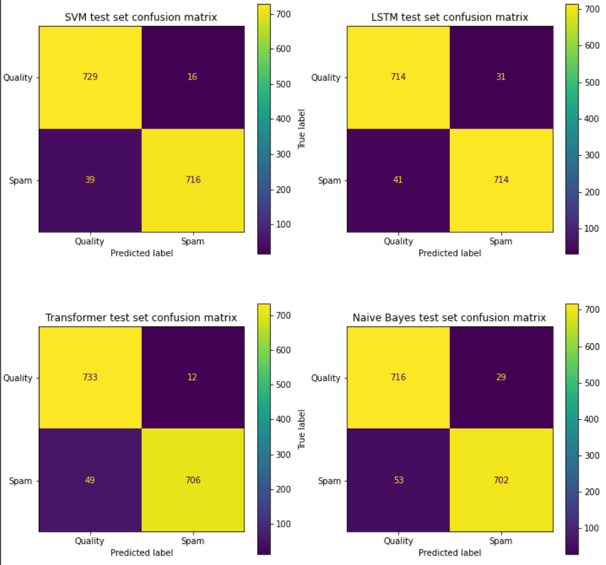
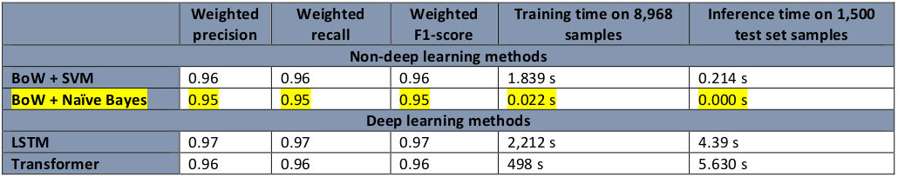
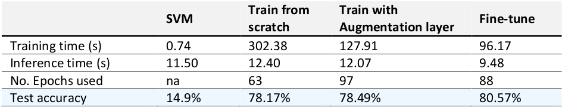
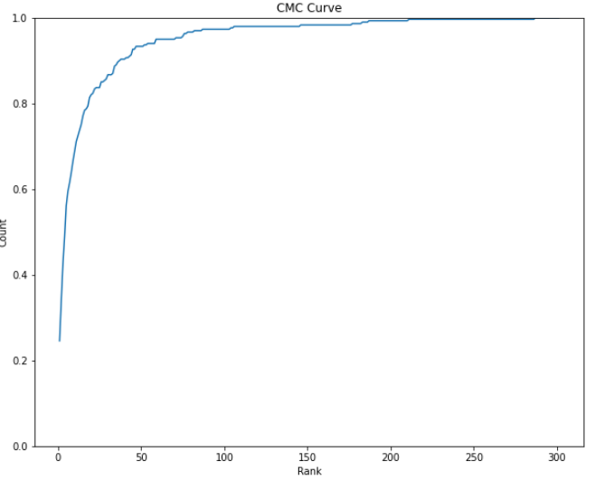
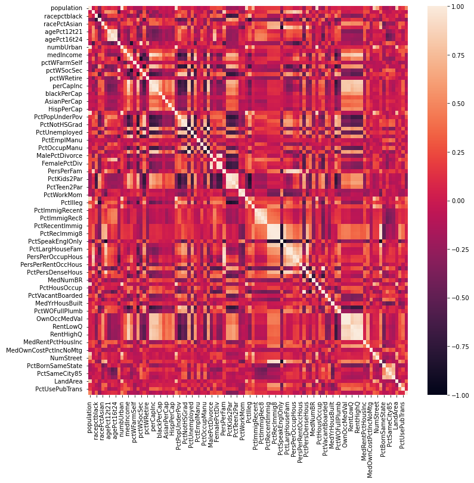
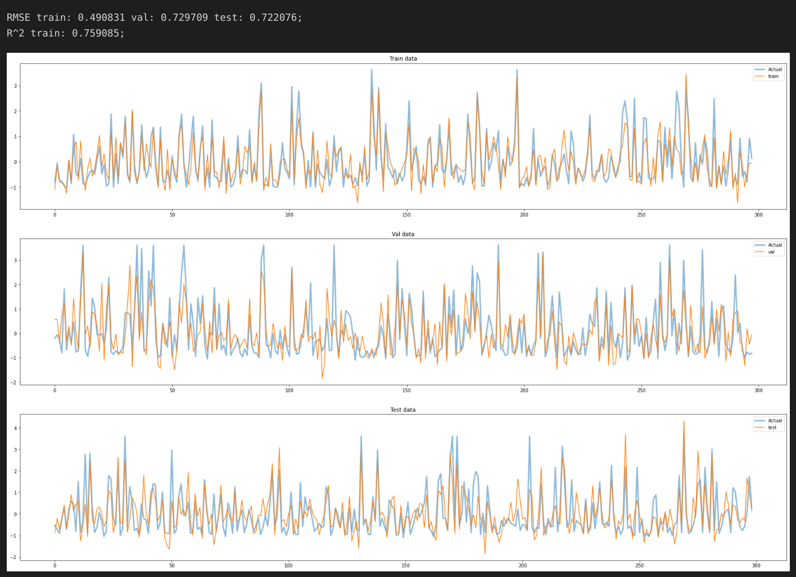
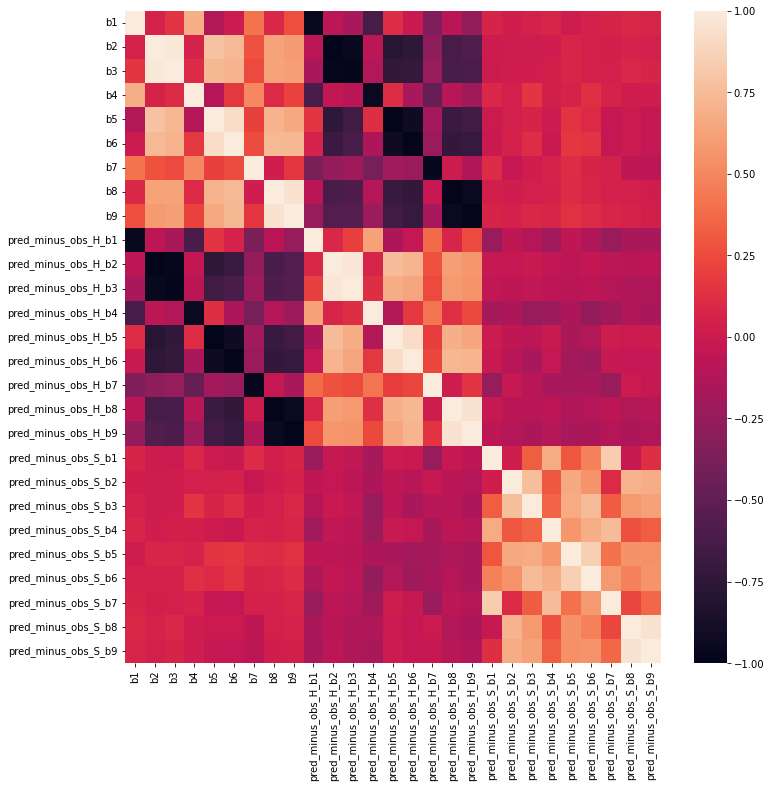
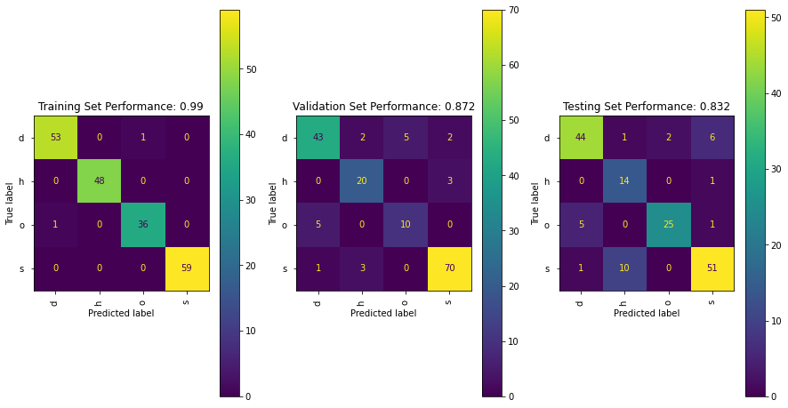

# **My AI/ML Projects** 😉

Some of my most hightlight AI/ML projects are present in this repo.  
A report is included in each project too.

 

## **1. Twitter Spam Detection -** [Click to explore](/1.%20Twitter%20Spam%20Detection/)

- Detect spam tweets using its content and some other numeric metadata. 4 methods are implemented: LSTM, Transformer, Naive Bayes, SVM. 
- Pre-processed tweets using Tokeniser (LSTM, Transformer) or Bag-of-words (SVM, Naive Bayes). In deep learning methods, other numeric data were fetched into the model via a separate second input stream.
- **The accuracies of all 4 methods are all >= 95%.** Naive Bayes has shown to be the best model for real world application in terms of training & inference time, scalability and computational demand.

    

    <figure><figcaption align="center"> Figure: Prediction results in condusion matrices</figcaption></figure>
    <figure><figcaption align="center"> Figure: Overall Performance of 4 methods</figcaption></figure>
    

    

 

## **2. Deep Convolutional Neural Network Applications -** [Click to explore](/2.%20Deep%20Convolutional%20Neural%20Network%20Applications/)

a) Number Classification
- Designed a **Neural Network** following VGG style to regconise numbers from Street View House Numbers dataset. This project removes a large part of the data to simulate data shortage.
- 3 approaches were used to train, test and evaluate the model:
    - Train from scratch
    - Apply **data augmentation** to combat data shortage
    - **Transfer learning** + Data augmentation
    

    
<b>View cool figures! 👈</b>

    

    <figure><figcaption align="center"> Figure: Performance of 3 approaches, plus a non-deep method - SVM</figcaption></figure>
    

    

b) Person Re-identification
- Implemented **Siamese model** and **Triplet Loss Function** for its advantage in focusing on increasing/decreasing distance between matching/mismatching data to re-identify person.
- Top-10 Accuracy reached 64% (i.e. subject is matched in the 10 most closest results with 64% success rate) and Top-1 Accuracy reached 25%. This is an impressive result given the simple model and low-quality dataset.
    

    
<b>View cool figures! 👈</b>

    

    <figure><figcaption align="center"> Figure: Cumulative Matching Characteristics (CMC) curve of the Siamese Model</figcaption></figure>
    

    

 

## **3. Movie Recommendation -** [Click to explore](/3.%20Movie%20recommendation%20-%20Clustering/)
- Uses Gaussian Mixture Model (GMM) out of other methods like HAC, DBScan, K-Means because of its scalability and probability assignment.
- The number of K cluster is chosen based on Bayesian Information Criterion which also takes model complexity into consideration
- For the result, suggested movies are closely related to user's watched ones and no obviously unrelated recommendation is detected

 

## **4. Regression & Classification -** [Click to explore](/4.%20Regression%20%26%20Classification/)

a) Regression
- Predicting crime percentage per population in a suburb by using (Linear Regression, Ridge, Lasso). 
- Analysis from correlation heat map shows many variables are redundent and measuring similar subjects. Data are standardised before fitting the model to set all columns' values to the same scale. Thus enhance accuracy and avoid bias.
    

    
<b>View cool figures! 👈</b>

    

    <figure><figcaption align="center"> Figure: Data correlation heatmap</figcaption></figure>
     
    <figure><figcaption align="center"> Figure: Linear Regression result and its prediction</figcaption></figure>
    

    

b) Classification
- Applied and Compare performance of 3 different classifiers (SVM, CKNN, Random Forest) in identifying 4 different forest types.
- Process also includes data split, finding the best params from Validation data using GridSearchCV and finally evaluate result on Test data.
    

    
<b>View cool figures! 👈</b>

    

    <figure><figcaption align="center"> Figure: Data correlation heatmap</figcaption></figure>
     
    <figure><figcaption align="center"> Figure: Confusion matrices of SVM prediction</figcaption></figure>
    

    

